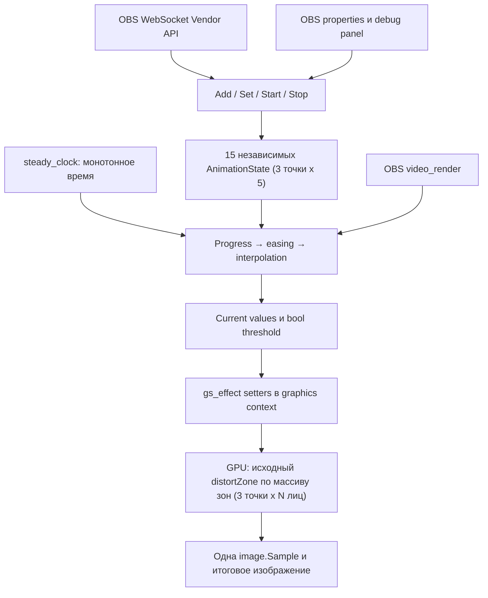

# Архитектура и производительность

## Схема



WebSocket/GUI меняют только маленькие числовые состояния под mutex. Изображение остаётся в графическом пайплайне OBS. Нет CPU image readback, обхода пикселей, CPU distortion, копирования кадров между CPU и GPU, отдельного WebSocket сервера или отдельного высокочастотного worker thread.

## Почему фильтр владеет shader effect

У стороннего obs-shaderfilter нет стабильного публичного API, позволяющего другому плагину получить его приватный `gs_effect_t` и безопасно менять uniforms. Получать private struct, угадывать offsets или вызывать graphics API из сетевого потока неправильно.

Правильны два разных маршрута:

| Сценарий | Маршрут |
|---|---|
| Управление произвольным сторонним фильтром | Получить filter source, `obs_source_get_settings`, изменить `obs_data_t`, `obs_source_update` |
| Один собственный shader + собственный controller | Владеть `gs_effect_t`, менять uniforms напрямую в `video_render` |

Для этой задачи выбран второй. Фильтр зарегистрирован с id `opa_6zone_distortion`. В `create` shader компилируется единожды; кэшируются указатели `zone_data` (массив), `zone_count`, `animate`, `uv_size`, `elapsed_time`. В `render` контроллер вычисляет значения точек, строит массив зон (для каждого лица и каждой включённой точки) и заполняет effect одним `gs_effect_set_val` для всего массива плюс `gs_effect_set_int/bool/vec2/float`; затем `obs_source_process_filter_end` запускает Draw. При уничтожении effect освобождается внутри graphics context.

`obs_data_t` нужен для сохранения позиций покоя (position/rest), целей `Start`, return endpoint, длительностей, easing и режима. OBS properties создают стандартный интерфейс этих settings; settings не являются оперативным состоянием анимации.
`AnimationState` хранится внутри `Engine`, по отдельности на каждый экземпляр фильтра.

Источник разрешается через `obs_get_source_by_name` или UUID, его фильтр — `obs_source_get_filter_by_name`. Фильтр по UUID также ищется в filter chains источников/сцен. Ссылки OBS удерживаются только на время разрешения команды. Registry связывает источник фильтра с weak_ptr Engine, не раскрывает внутренние структуры сторонних плагинов и не хранит лишние strong source refs. GUI тоже держит weak_ptr; удалённый фильтр не должен оставаться живым из-за панели.

Важная деталь libobs: `gs_technique_end` очищает текущие effect parameter values. Поэтому перед КАЖДЫМ draw массив зон и служебные параметры задаются заново: `zone_data` (массив, один вызов), `zone_count`, `animate`, `uv_size`, `elapsed_time` — 5 вызовов. Кэширование неизменных значений с пропуском setters в этом маршруте привело бы к восстановлению defaults. Счётчик `uniformCalls` считает эти 5 вызовов, не driver uploads и не image/ViewProj, которыми управляет OBS. Значения зон теперь передаются одним массиво́м вызовом вместо 30 отдельных setter-ов.

## Структура проекта и классы

| Файл | Назначение |
|---|---|
| CMakeLists.txt | Native module, Qt dependencies, CTest, Windows/Linux install |
| src/plugin-main.cpp | OBS module lifecycle, регистрация фильтра/дока/Vendor API |
| src/animation.hpp | Чистая математика и состояние без OBS/Qt |
| src/filter.hpp | Engine, Snapshot, публичные функции разрешения фильтра |
| src/filter.cpp | ShaderController, render, settings, properties, registry |
| src/ui.hpp, src/ui.cpp | Qt panel с таблицей, manual controls, debug log |
| src/ws_vendor.hpp, src/ws_vendor.cpp | Vendor requests, validation, status |
| include/obs-websocket-api.h | Официальный upstream header |
| data/original-6-zone.effect | Предоставленный shader без изменений |
| data/6-zone.effect | Исходник + host wrapper libobs |
| data/face-points.effect | Динамический шейдер: массив зон `zone_data[]` + `zone_count` |
| src/face_tracker.hpp/.cpp | YuNet-детекция и 3 якоря на лицо (фоновый поток) |
| data/original.sha256 | SHA-256 оригинала |
| tools/wrap_shader.py | Воспроизводимое добавление только wrapper |
| tools/build-windows.ps1 | Configure/build/test/stage |
| tests/animation_tests.cpp | Easing/time/interrupt/ADD/return/limits/bool tests |
| tests/verify_shader.py | Проверка неизменности оригинала |
| examples/*.json | Настройка шести зон, StartAll, Add |
| docs/*.md | Architecture, API, performance, validation |

`AnimationState` хранит startValue/currentValue/targetValue/startTime/duration/easingType/active/progress/phase.

`AnimatedParameter` содержит состояние одной величины, допустимый диапазон, bool flag, значение покоя (rest), return endpoint и настройки move/hold/return. При запуске настройки возврата фиксируются для данного движения; новые настройки влияют на следующие запуски.

`ZoneController` содержит Enable, Offset X, Offset Y, Radius, Magnitude одной точки. `AnimationController` содержит ровно три ZoneController (лоб / переносица / ниже подбородка), всего 15 AnimatedParameter. В нём нет OBS API или GPU кода.

`Easing` вычисляет только преобразование прогресса. `Engine` добавляет mutex, режим, defaults, частоту, короткий лог и метрики. `ShaderController` владеет GPU effect, uniform handles и shared_ptr Engine.

Иерархия: AnimationController → 3 ZoneController → 5 AnimatedParameter → AnimationState. Это небольшой фиксированный массив, а не карта динамических объектов на каждом кадре.

## Время и прерывание

Используется `std::chrono::steady_clock`. Он монотонный: изменение часов Windows, синхронизация времени и часовой пояс не меняют длительность. В MSVC на Windows steady_clock использует QueryPerformanceCounter. Прямой QPC возможен, но здесь не даёт преимущества и требует явной работы с частотой счётчика. `high_resolution_clock` не выбран: стандарт C++ не гарантирует его монотонность на всех платформах. `system_clock` / QDateTime не подходят для длительности.

Расчёт:

```cpp
progress = clamp((now - startTime) / duration, 0.0, 1.0);
easedProgress = Easing::apply(easingType, progress);
currentValue = startValue + (targetValue - startValue) * easedProgress;
```

После интерполяции значение ограничивается допустимым диапазоном uniform. Это сохраняет нормальные bounds исходного shader. Back/Elastic намеренно могут выдавать easedProgress вне 0..1; преждевременного clamp результата easing нет. Ограничение итогового значения может обрезать overshoot у границы диапазона. Для наблюдения overshoot выбрать цель внутри допустимого диапазона.

На каждую новую команду сначала вычисляется прерываемая траектория на ТОЧНОМ моменте команды. Именно это значение становится новым startValue. StartTime обновляется; текущая величина не подставляется ни из старого start, ни из старой target. Получается позиционная непрерывность `37 → 0`, `37 → 80 → … → 0`. Непрерывность скорости/ускорения не обещается: новый easing стартует с новой производной. Для инерционного продолжения нужен отдельный velocity-aware механизм, которого в запрошенной формуле нет.

ADD во время Attack/Hold: новая цель = старая цель + delta. ADD во время Return/Idle: цель = текущее значение + delta. Это позволяет действительно усиливать затухающий эффект, а не прибавлять дельту к нулевой return target. Повторный ADD перезапускает attack duration от current, не от исходной величины. На каждой стадии endpoint ограничивается bounds.

Attack заканчивается на абсолютном `startTime + duration`; Hold и Return также привязаны к абсолютным границам. При большой паузе между кадрами контроллер сразу проходит уже истёкшие стадии, не начинает возврат заново с момента позднего кадра. Duration 0 означает немедленное достижение цели; это явное исключение из плавного режима.

## Easing

31 вариант: Linear и In/Out/InOut для Quad, Cubic, Quart, Quint, Sine, Expo, Circ, Back, Elastic, Bounce. UI и API используют точные имена вида `EaseOutCubic`, `EaseInOutElastic`. `Ease In` / `Ease Out` — направления, а Quad/Cubic и остальные — семейства; это не отдельные неоднозначные названия API.

Все easing дают точно 0 в начале и точно 1 в конце. Expo имеет явные endpoint cases, Circ защищён от отрицательного sqrt из-за округления. Back и Elastic используют стандартные константы; Bounce — четыре квадратичных сегмента. Linear даёт e(t)=t.

## Enable: ограничение исходного bool

Исходный uniform Enable — bool, а shader содержит `if (zoneX_enable)`. Непрерывно интерполировать изображение через такой uniform нельзя. Контроллер позволяет анимировать внутреннюю величину 0..1, но передаёт bool по порогу 0.5. UI явно показывает и числовой Current, и фактический GPU value 0/1.

Back/Elastic/Bounce для Enable могут пересекать порог несколько раз; для одного переключения выбирать Linear/монотонное easing. Если понадобится плавное визуальное включение зоны, его можно сделать анимацией Magnitude от 0 при постоянно включённом Enable. Настоящий fade-enable потребовал бы float weight и изменения shader, что здесь сознательно не сделано ради сохранения оригинала.

## Три режима и старый animate

| Режим | Uniform animate | Что меняется |
|---|---|---|
| Static | false | Текущие uniforms; выполняемых C++ анимаций нет |
| Shader | true | Исходное синусоидальное умножение magnitude |
| Plugin | false | C++ Attack/Hold/Return с easing |

В shader mode исходная строка `mag *= sin(radians(elapsed_time * 20.0))` умножает magnitude всех включённых зон на один общий sin. При elapsed_time в секундах это 20 градусов/сек, полный цикл 360/20 = 18 секунд. Сила проходит через 0, достигает положительного максимума, снова 0, отрицательного максимума, снова 0. Переход знака включает другую ветку distortZone, поэтому это не просто одностороннее ослабление. Все зоны синхронны; center/radius эта логика не анимирует.

Синус — уже time-based GPU функция, но не универсальный animation controller: нет произвольных endpoints/durations/easing/retarget/ADD/hold/return или per-parameter state. Его не нужно удалять: он сохранён в оригинальном коде и доступен отдельно.

Режимы взаимоисключающие. При переключении активные C++ траектории останавливаются на current. В shader mode это current magnitude становится амплитудой синуса, elapsed_time считается от создания фильтра. Возврат в Static/Plugin сохраняет current uniforms, не старые endpoints. Переключение между sine и static может визуально дать скачок, поскольку effective magnitude = amplitude × sin, а Static использует amplitude; автоматического кроссфейда режимов здесь нет. Это не конфликт двух систем: они никогда не управляют magnitude одновременно. Плавный переход режима с подхватом эффективной силы потребовал бы отдельной команды/политики.

В debug Current для shader mode — amplitude uniform, а не значение после синуса в GPU. Для сопоставления картинки учитывать sin-factor и текущую фазу.

## Частота и OBS rendering

По умолчанию расчёт производится при каждом `video_render` данного фильтра. Uniform изменяется перед draw в правильном graphics context. Независимый QTimer для анимации не используется: он мог бы просыпаться между кадрами, потреблять CPU без нового изображения и требовать синхронизации данных. Qt timer относится только к debug UI.

| Частота OBS / контроллера | Результат |
|---|---|
| OBS 30, Match | До 30 новых видимых состояний/сек |
| OBS 60, Match | До 60, хороший стандарт |
| OBS 120, Match | До 120, максимальная плавность при 120-FPS выводе |
| OBS 60, cap 30 | Значения повторяются на части кадров; длительность сохраняется |
| OBS 60, cap 120 | Не появляются дополнительные изображения; расчёт ограничен render calls |
| OBS 120, cap 60 | До 60 состояний/сек, заметные ступени относительно 120 |

Cap 30/60/120 реализован deadline buckets на монотонной шкале, без накопления frame delta. Он ограничивает математику, но не обязательные setters перед draw. Match предпочтителен: расчёт 30 easing намного меньше стоимости shader/OBS rendering. Если источник используется несколько раз, количество вызовов render зависит от кеширования OBS; поэтому это лимит оценок состояния, а не гарантия количества GPU draw calls.

При потерянных кадрах анимация не замедляется. Следующий реально отрисованный кадр берёт состояние по текущему времени; конец виден на первом доступном кадре после deadline, с погрешностью дискретизации/планирования. Невозможно показать промежуточные состояния кадра, который не был отрисован. Неактивный/невидимый фильтр не занимается расчётом ради пустых кадров; при следующем render догоняет абсолютное время. UI Get показывает последнее sampled состояние до нового render/команды, это не отдельный ticker.

## Шесть фильтров против одного

| Характеристика | A: шесть отдельных однопроходных фильтров | B: один исходный shader с шестью зонами |
|---|---|---|
| Filter shader passes | Обычно 6 | 1 |
| Sample instructions на итоговый пиксель по цепочке | Обычно по 1 на каждый pass, суммарно 6 | Одна в mainImage |
| GPU вычисления distortion | Один distortion на каждый pass | До 3 x N последовательных distortZone в одном pass |
| CPU draw/state preparation | Шесть filters/effects | Один effect/controller |
| Render targets / VRAM | Несколько промежуточных surface buffers | Меньше промежуточных surface buffers |
| Uniform bindings | Шесть комплектов | Один массив зон `zone_data[]` + служебные (5 вызовов) |
| Состояние анимаций | Шесть отдельных controllers | Один фиксированный массив |

Это теоретическое сравнение при одинаковых resolution/format и однопроходных исходниках, не результаты измеренного benchmark. OBS compositor/source capture тоже может добавлять passes; шесть filters не всегда означают ровно шесть draw calls за весь кадр. Одна `image.Sample` — одна texture sampling instruction; билинейная фильтрация может затрагивать несколько texels, это не утверждение об одном физическом чтении VRAM.

Размер RGBA8 поверхности 1920×1080 ≈ 7.91 MiB; 3840×2160 ≈ 31.64 MiB. Реальная VRAM зависит от caching/pooling, числа buffers, формата, источников и backend. Нельзя гарантировать экономию ровно пяти таких поверхностей или «в шесть раз быстрее». ALU для шести distortions остаётся; экономятся главным образом повторные sampling/resampling, render-target bandwidth и pass overhead.

Цепочка отдельных filters и композиция UV за одну выборку не обязаны быть визуально идентичными: цепочка повторно интерполирует уже изменённые изображения, плюс порядок композиции может отличаться. Здесь эталон — предоставленный единый шестизонный shader, а не шесть отдельно наложенных filters. Оригинальные функции и mainImage включены в compiled effect байт в байт.

Сам C++ easing не запускается на GPU и не добавляет shader passes/sample instructions. Передача маленьких uniform значений имеет ненулевой, обычно небольшой overhead. Но изменение magnitude/radius/Enable может активировать дополнительные ветви и увеличить площадь искажения; поэтому GPU load динамической сцены может отличаться от статического нулевого magnitude. Утверждение «любая анимация совсем не увеличивает GPU load» неверно: добавленная математическая CPU система мала, но изменённое состояние shader влияет на его работу.

## Ограничения совместимости изображения

Host wrapper задаёт Linear/Clamp sampler, uv_size из размеров filter target, ViewProj/vertex shader/Draw technique. Distortion, corrections и исходные defaults не менялись. В оригинальном `.effect` этих host declarations не было: их предоставлял obs-shaderfilter. Теперь их предоставляет native plugin.

Путь GS_RGBA ориентирован на SDR, как обычный эффект-фильтр. Отдельная HDR/color-space policy не реализована. Сравнивать изображение нужно при одинаковых SDR color settings, sampler и shader animation phase; одного сравнения функций недостаточно для доказательства идентичности всех аспектов host pipeline.

Источники API: [OBS Graphics](https://docs.obsproject.com/graphics), [Source API](https://docs.obsproject.com/reference-sources), [Properties](https://docs.obsproject.com/reference-properties), [libobs effect.c](https://github.com/obsproject/obs-studio/blob/32.1.0/libobs/graphics/effect.c), [Microsoft steady_clock](https://learn.microsoft.com/en-us/cpp/standard-library/steady-clock-struct?view=msvc-170).
